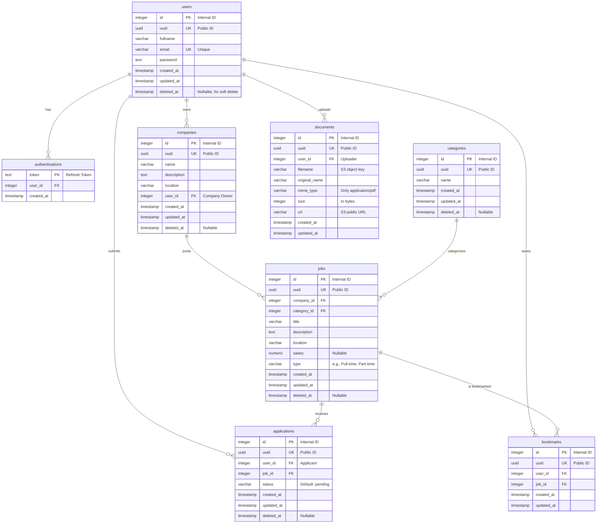

# Database Design Document

> **Project:** OpenJob API
> **Version:** 1.0.0
> **Last Updated:** 2026-04-25

---

## 1. Overview

This document outlines the database schema and Entity-Relationship Diagram (ERD) for the OpenJob API. The database is designed using PostgreSQL and adheres to Third Normal Form (3NF) to ensure data integrity and scalability.

**Dual-ID Strategy:**
To optimize internal performance while maintaining external security, all main entities use a dual-ID approach:

1.  **`id` (Integer / Serial PK):** Used purely internally as the Primary Key and for Foreign Key relationships. Integers provide significantly faster indexing and join performance.
2.  **`uuid` (UUID v7 UK):** Used as the public-facing identifier exposed via REST APIs. This prevents ID enumeration/guessing attacks (Insecure Direct Object Reference) from clients.

All main entities also implement a **Soft Delete** strategy using the `deleted_at` column to maintain an audit trail and preserve historical relationships.

---

## 2. Entity Relationship Diagram (ERD)

The following diagram illustrates the core entities and their relationships using the dual-ID approach.

---

## 3. Data Dictionary

_Note: In API requests/responses, the internal `id` (Integer) is never exposed. The `uuid` field is mapped to `id` in JSON responses._

### 3.1 `users`

Stores user account information, including candidates and company owners.

- **Indexes:** `email` (Unique, B-Tree), `uuid` (Unique, B-Tree).

### 3.2 `authentications`

Stores valid refresh tokens for active sessions.

- **Note:** Tokens are deleted when a user logs out. Uses `user_id` (Integer) for internal fast lookup.

### 3.3 `companies`

Stores company profiles created by users.

- **Indexes:** `uuid` (Unique, B-Tree), `user_id` (FK, B-Tree).

### 3.4 `categories`

Lookup table for job categorizations (e.g., "Software Engineering", "Marketing").

- **Indexes:** `uuid` (Unique, B-Tree).

### 3.5 `jobs`

Stores job postings associated with a company and a category.

- **Indexes:** `uuid` (Unique, B-Tree), `company_id` (FK, B-Tree), `category_id` (FK, B-Tree).
- **Search Optimization:** Consider adding a trigram index (GIN) on the `title` column for faster ILIKE/partial text searches in the future.

### 3.6 `applications`

Junction table mapping users (candidates) to jobs they have applied for.

- **Indexes:** `uuid` (Unique, B-Tree), `user_id` (FK), `job_id` (FK).
- **Constraint:** A composite unique constraint on `(user_id, job_id)` can be applied if a user is only allowed to apply once per job.

### 3.7 `bookmarks`

Allows users to save jobs for later viewing.

- **Indexes:** `uuid` (Unique, B-Tree).
- **Constraint:** Unique composite key on `(user_id, job_id)` to prevent duplicate bookmarks.

### 3.8 `documents`

Stores metadata and S3 URLs for PDF resumes uploaded by users.

- **Indexes:** `uuid` (Unique, B-Tree).

---

## 4. Soft Delete Constraints & Cascading

Because we are using **Soft Deletion** (`deleted_at`), standard database-level `ON DELETE CASCADE` constraints are not utilized for main entities.

Instead:

- When a `Company` is soft-deleted, its associated `Jobs` should logically be treated as unavailable. This is enforced at the Application/ORM layer.
- The only table utilizing hard deletes is `authentications` (on logout).
- `bookmarks` can be hard-deleted since they are merely user preferences and do not affect the audit trail.

---

## Revision History

| Version | Date       | Author       | Changes          |
| ------- | ---------- | ------------ | ---------------- |
| 1.0.0   | 2026-04-25 | Gilang Heavy | Initial Document |
